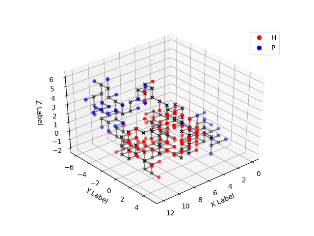

Elf Protein Structure Prediction - Parallel ABC Algorithm
===

<a href="https://mjsaldanha.com"></a>

Implementations of a Protein Structure Prediction (PSP) program, using an Artificial Bee Colony optimization algorithm.

**Internal documentation [here](https://matheushjs.github.io/ElfPSP_ParallelABC/files.html).**

Index
---

- [Overview](#overview)

- [Requirements](#requirements)

- [Compiling](#compiling)

- [Usage](#usage)

- [Output Format and Visualization](#output)

- [Configuring Internal Parameters](#configuring)


<a name="overview"></a>
Overview
---

In this repository is my implementation of a Protein Structure Prediction (PSP) program found in the literature, which I analyzed and optimized in various ways, which is why there are multiple versions of the implementation.

The PSP program in question is the one described by Professor César Benítez and Professor Heitor Lopes in their article "Parallel Artificial Bee Colony Algorithm Approaches for Protein Structure Prediction Using the 3DHP-SC Model", whose complete reference is given below.

> Benítez, C.M.V. and Lopes, H.S., 2010. Parallel artificial bee colony algorithm approaches for protein structure prediction using the 3dhp-sc model. In Intelligent Distributed Computing IV (pp. 255-264). Springer, Berlin, Heidelberg.

The authors provide 2 parallelizations of a sequential PSP program that is described very thoroughly in their article. One of the parallelizations consist in splitting the work among nodes who communicate among themselves in a master-slave fashion; the other version (called Hybrid Hierarchical) splits the work among many master-slave systems, each of which work exactly the same way as the first parallelization described, and the masters communicate among themselves periodically in a ring logical topology. I only implemented the Hybrid Hierarchical version, because it can work exactly the same way as the master-slave version if you configure its parameters accordingly.

I've been investigating their proposal due to my [research project](https://mjsaldanha.com/sci-projects/1-psp-project-1/), and during analysis I found out that I could greatly improve the execution time of the program by modifying the most time-consuming procedure: **collision and contact counting**. We implemented 5 different versions of such procedures:

- **Quadratic**: regular, quadratic-complexity counting (for each bead, check if it collides with any subsequent beads);

- **Linear**: linear-complexity algorithm that we proposed, which is better explained in the [original repository](https://github.com/matheushjs/ElfCudaLibs/tree/master/ElfColCnt);

- **Quadratic Threads**: parallelization of the quadratic approach, using OpenMP to share the work among threads;

- **Linear Threads**: parallelization of the linear approach, using OpenMP to share the work among threads;

- **CUDA**: efficient parallelization that we proposed for the quadratic approach, using the CUDA programming model (also better explained in the [original repository](https://github.com/matheushjs/ElfCudaLibs/tree/master/ElfColCnt)).

These 4 versions of contact/collision counting were implemented with both versions of the optimization algorithm: 1) the sequential optimization algorithm, and 2) the optimization algorithm that is proposed by the authors as parallelized in the MPI programming model, in a way where different processing nodes share good predicted proteins among themselves. This caused the program to have 10 versions in total: `seq_quad`, `seq_lin`, `seq_lin_threads`, `seq_threads`, `seq_cuda`, `mpi_quad`, `mpi_lin`, `mpi_lin_threads`, `mpi_threads`, `mpi_cuda`.

<a name="requirements"></a>
Requirements
---

Requirements vary depending on the program version you'd like to compile.

- `seq_quad`
  - C compiler `gcc`

- `seq_lin`
  - C compiler `gcc`

- `seq_lin_threads`
  - C compiler `gcc` with support for the flag `-fopenmp` (most gcc comes with it by default)

- `seq_threads`
  - C compiler `gcc` with support for the flag `-fopenmp` (most gcc comes with it by default)

- `seq_cuda`
  - C compiler `gcc`
  - CUDA compiler `nvcc`

- `mpi_quad`
  - C compiler `gcc`
  - MPI compiler `mpicc` (preferably from OpenMPI, as the program shows problems with MPICH)

- `mpi_lin`
  - C compiler `gcc`
  - MPI compiler `mpicc` (preferably from OpenMPI, as the program shows problems with MPICH)

- `mpi_lin_threads`
  - C compiler `gcc` with support for the flag `-fopenmp` (most gcc comes with it by default)
  - MPI compiler `mpicc` (preferably from OpenMPI, as the program shows problems with MPICH)

- `mpi_threads`
  - C compiler `gcc` with support for the flag `-fopenmp` (most gcc comes with it by default)
  - MPI compiler `mpicc` (preferably from OpenMPI, as the program shows problems with MPICH)

- `mpi_cuda`
  - C compiler `gcc`
  - CUDA compiler `nvcc`
  - MPI compiler `mpicc` (preferably from OpenMPI, as the program shows problems with MPICH)


<a name="compiling"></a>
Compiling
---

If you run `make`, it will make all the program versions. The versions are called as described in [Requirements](#requirements), so you can make them separately with the commands below.
```makefile
make seq_lin
make seq_quad
make mpi_threads
make mpi_cuda
```

Compiling generates a lot of cumbersome files, which can be cleaned with `make clean`.

<a name="usage"></a>
Usage
---

When you run `make`, many binary executable files will be built in the root of the directory. The ones that don't use MPI can be run as any other executable file

```
$ ./seq_lin -h
Usage: ./seq_lin [HP_Sequence] [num_cycles] [output file]
```

As you can see, the sequential versions receive 3 optional parameters on command line, 2 of which are optional. Many input parameters can also be specified through the [configuration.yml](configuration.yml) file in the root of the directory.

The `HP_Sequence` is a string of H and P characters, which represent the sequence of aminoacids of the protein whose structure you want predicted. These letters stand for "hydrophobic" and "polar" aminoacids. `num_cycles` refer to the number of cycles of the optimization algorithm, Artificial Bee Colony, and more cycles should result in better predictions. The `output file` is the filename of the file to which we should write the output of the program, whose format is described later.

An example of usage and output is as follows:

```
$ ./seq_lin HHHPHPHHHHPHHPHPPHHHHH 10000
Fitness: 1848.198080
Hcontacts: 52
Collisions: 14
BBGyration: 1.453835
Time: 5.269768
```

where `Hcontacts` is the number of hydrophobic contacts in the structure predicted; `collisions`, the amount of collisions; and BBGyration, the gyration radius of the protein.

Unlike the sequential versions, the parallel versions should be executed using the `mpirun` command, like follows:

```
$ mpirun -n 4 ./parallel_lin HHHPHPHHHHPHHPHPPHHHHH 10000
Fitness: 1983.246602
Hcontacts: 42
Collisions: 8
BBGyration: 1.775057
Time: 4.688627
```

<a name="output"></a>
Output Format and Visualization
---

The predicted protein structure is saved in file `output.txt` by default, unless some filename has been specified as a command line argument. The format of the file is as follows:

```
[backbone bead 0]
[sidechain bead 0]
[backbone bead 1]
[sidechain bead 1]
[backbone bead 2]
[sidechain bead 2]
[...]
[backbone bead N]
[sidechain bead N]

[HP chain]
```

The structure can be visualized using a Python script provided in the `utils/` directory, as follows:

```
./utils/protein_vis.py output.txt figure.png
```

Which should show a GUI for visualizing and interacting with the protein structure. Besides that, an image is saved in the file specified on command line (`figure.png` in the example). You'll need `numpy` and `matplotlib` installed for running the Python script. An example of visualization is given below.



<a name="configuring"></a>
Configuring Internal Parameters
---

The program has a number of internal parameters (macros) that can be configured. All the parameters can be changed in the file [configuration.yml](configuration.yml); each parameters is also described in such file.

For example, the default number of bees in the colony is 250, but say you want to change it to 1000. You can do it by setting in the [configuration.yml](configuration.yml):

```
COLONY_SIZE: 1000
```

Although the file has YAML extension, it can't be restructured as any YAML file. Please, only change the values within this file, without reordering the parameters or adding newlines; the program might not recognize the file contents depending on how it is changed.

Some parameters, such as HP_CHAIN, can also be passed as argument to the program. Arguments have precedence over what is within the [configuration.yml](configuration.yml) file.
